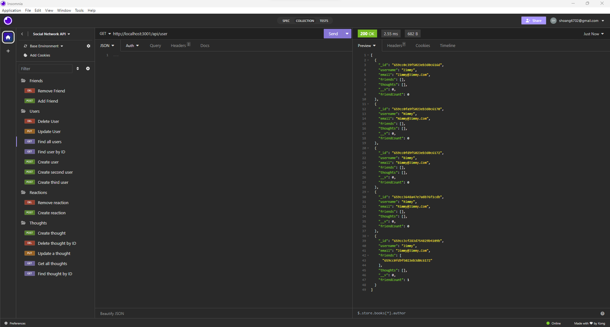

# S_Hoang-NoSQL-SN-API
A social Network API developed by me!

## Installation
Download from repository and set up in Insomnia as shown in the video

## Usage

Github Repository
https://github.com/SHoang6702/S_Hoang-NoSQL-SN-API

Youtube Link
https://www.youtube.com/watch?v=uvueKcUfNzI

## Credits
Collaborators:
Sebastian Hoang

## Features

### Friends
- Add friends
- Remove friends
### Users
- Create new users
- Delete users
- Update users
- Find users
- Find users by id
### Reactions
- Create reactions
- Remove reactions
### Thoughts
- Create new thoughts
- Delete thoughts
- Update thoughts
- Find thoughts
- Find thoughts by id
## License
None
